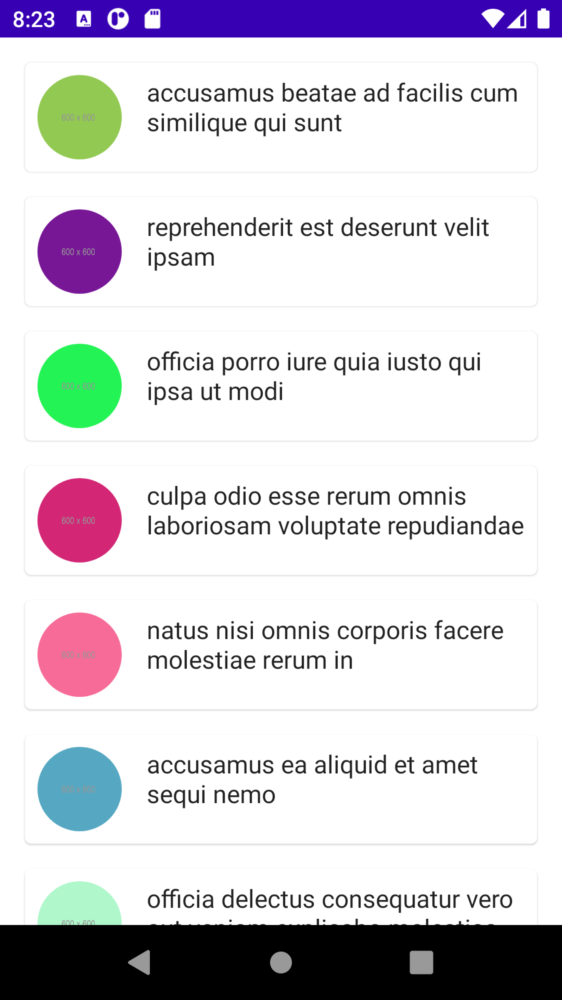
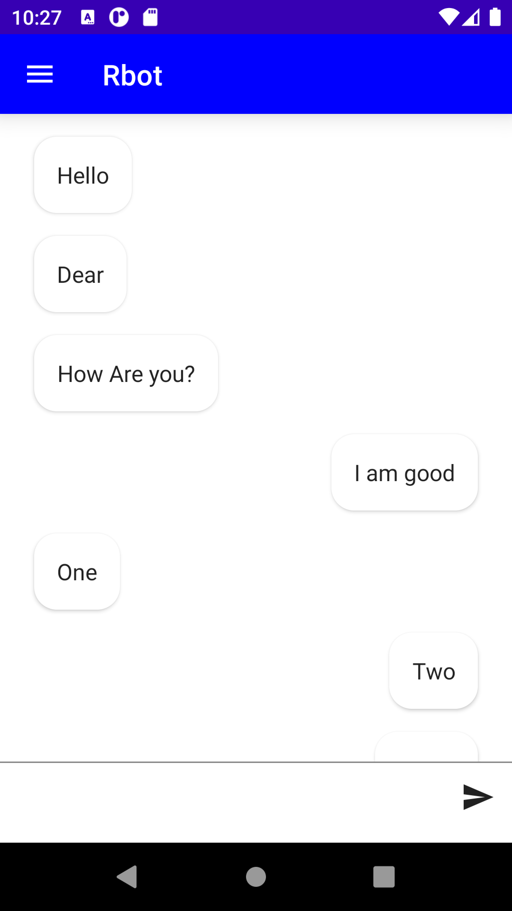

# Jetpack Samples with Compose, Hilt, Retrofit, coroutines using MVVM Architecture

 

## About
This is a demo application built using modern Jetpack Tools. 

## Using
- [Kotlin](https://kotlinlang.org/) - Official programming language for Android development.
- [Compose](https://developer.android.com/jetpack/compose) - Jetpack Compose is Android’s modern toolkit for building native UI. It simplifies and accelerates UI development on Android. 
- [Hilt](https://developer.android.com/training/dependency-injection/hilt-jetpack) - Fully static Dependency injection library for Android.
- [Android Architecture Components](https://developer.android.com/topic/libraries/architecture) - Collection of libraries that help you design robust, testable, and maintainable apps.
- [ViewModel](https://developer.android.com/topic/libraries/architecture/viewmodel) - Stores UI-related data that isn't destroyed on UI changes. 
- [Coroutines](https://kotlinlang.org/docs/reference/coroutines-overview.html) - Asynchronous or non-blocking programming is an important part of the development landscape.
- [Retrofit](https://square.github.io/retrofit/) - A type-safe HTTP client for Android,Annotations on the interface methods and its parameters indicate how a request will be handled.

 

## Screenshots

	   
	   

